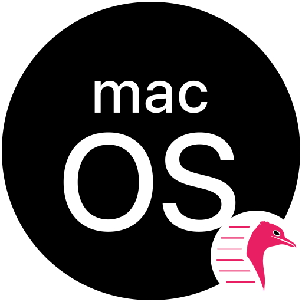
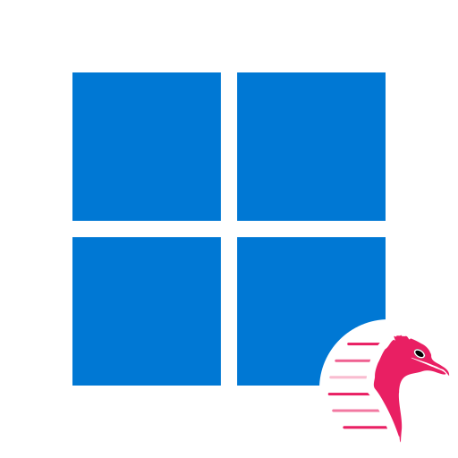

# Quickemu - Icons

VM icons for various operating systems for use in desktop files etc.

## Examples
<table>
	<thead>
		<tr>
			<th>OS</th>
			<th>PNG</th>
			<th>SVG</tg>
		</tr>
	</thead>
	<tbody>
		<tr>
			<th><b>macOS</b></th>
			<td></td>
			<td></td>
		</tr>
		<tr>
			<th><b>Ubuntu</b></th>
			<td></td>
			<td></td>
		</tr>
		<tr>
			<th><b>Windows</b></th>
			<td></td>
			<td></td>
		</tr>
   	</tbody>
</table>
